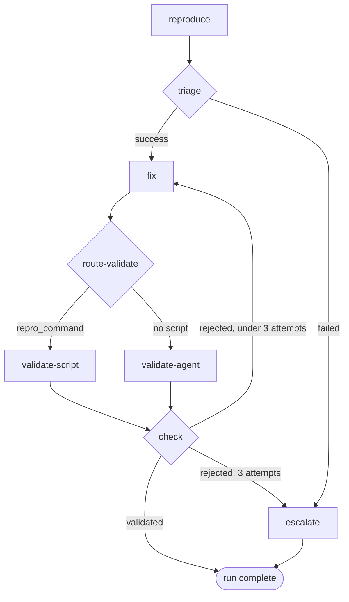

# The bugfix workflow

## Overview

`bugfix` is the worked example of a rigorous workflow: reproduce the bug as an
executable script, fix it, validate the fix in a bounded loop, and escalate to
the operator when the loop is exhausted or the bug was never reproducible.

It exists to demonstrate what the [workflow engine](workflow-engine.md) is
for. Nothing in it is hidden or heuristic — every route is explicit, the loop
bound is deterministic, and every dead end is a human gate.

## Definition

A packaged YAML document
(`daemon/src/ompire_daemon/builtin_workflows/bugfix.yaml`). Each task pins the
revision it was accepted under, so the routes below describe *your task's*
`bugfix` — a later release that edits this definition does not change a run
already in flight. See [Workflow engine](workflow-engine.md#definitions-and-revisions).

Sessions `["reproducer", "coder"]`, primary `coder` — so review, ship, and
task-scoped agent operations target the coder.

| # | Step | Kind | Session |
|---|---|---|---|
| 1 | `reproduce` | agent, outcome-bearing | `reproducer` |
| 2 | `triage` | decision | — |
| 3 | `fix` | agent, outcome-bearing | `coder` |
| 4 | `route-validate` | decision | — |
| 5 | `validate-script` | command | — |
| 6 | `validate-agent` | agent, outcome-bearing | `reproducer` |
| 7 | `check` | decision | — |
| 8 | `escalate` | gate | — |

Splitting reproduction and fixing across two sessions is deliberate: the
session that decides whether the bug still reproduces is not the session that
wrote the fix. That separation is about context, not about models — each of
these steps carries its own accepted model policy, and two steps in one session
may differ.

## States and behavior

### 1. Reproduce

The prompt is the accepted preamble joined to the task's stored prompt — the
issue — and instructs the agent to investigate, write an executable reproducer
at `.ompire/repro.sh` that exits non-zero while the bug is present and zero
once fixed, confirm the script currently fails, and finish through the outcome
file.

The outcome carries a summary and, when a runnable script was produced, a
`repro_command` artifact, plus `expected_behavior` and `observed_behavior`
when determinable.

### 2. Triage

| Latest `reproduce` outcome | Route |
|---|---|
| `status: "success"` | `fix` |
| anything else | `escalate` |

A bug that cannot be reproduced is operator triage, not a coding task. Sending
an agent to fix something nobody has demonstrated is how a plausible,
unverifiable change gets written. A `"failed"` reproduction is a real, declared
result and takes the declared route; it does not stop the run.

A `reproduce` attempt that leaves *no* outcome never reaches this decision —
the step itself pauses on its missing required result.

### 3. Fix

The prompt carries the issue, the reproduction handoff — the latest
`reproduce` outcome's summary and artifacts, or an explicit note that no
structured handoff exists and the agent should inspect `.ompire/` and the
working tree — and, on loop revisits, the latest validation report.

It forbids editing `.ompire/` and weakening the reproducer, and instructs the
coder to **commit the fix on the task branch** and never push.

Committing is instructed, not load-bearing: the review flow's reset dance
unstages everything for the reviewer either way, and the ship flow's squash
commit stages the whole working tree — committed or pending — so an agent
that stops at a worktree-only fix still ships correctly.

### 4. Route validation

| Condition | Route |
|---|---|
| Latest `reproduce` outcome carries `repro_command` | `validate-script` |
| Otherwise | `validate-agent` |

Not every bug is scriptable — a visual defect, for instance — so the workflow
falls back to an agent verdict rather than pretending a script exists.

### 5–6. Validate

`validate-script` runs `bash .ompire/repro.sh` in the task's clone via
`workshop exec`, recording the exit code and output tail.

`validate-agent` sends **no prompt** and completes immediately when a
`validate-script` record newer than the latest `fix` record exists — the
script already answered, so an agent turn would be wasted. Otherwise it
prompts the `reproducer` to re-run the reproduction and judge the fix, with
outcome `status: "success"` meaning validated and `"failed"` meaning rejected,
its summary being the report.

### 7. Check

Reads the validation signal for the current fix iteration — the latest
`validate-script` or `validate-agent` record newer than the latest `fix`
record.

| Signal | Result |
|---|---|
| Script exit `0`, or agent `status: "success"` | Validated — run completes |
| A validation result that is neither | Route back to `fix` |
| No validation result for this iteration | [Pause](workflow-engine.md#uncertainty-pauses) |

**The bound is three fix attempts.** It is declared on the `fix` step itself
and enforced by the engine, which counts attempts *before* opening a new one —
so the third rejection routes to `fix` and the engine sends it to `escalate`
instead. The route predicate is not what stops the loop, which is why a
mistake in it cannot make the loop run forever. A daemon restart mid-attempt
costs no visit.

### 8. Escalate

The gate message names the cause — bug not reproducible, or the iteration bound
exhausted with the latest validation report — and the current state of play. A
notify-tier attention entry is raised. It is a *declared gate*: resuming closes
the run out. It never claims the bug was fixed.

As the last declared step, resuming completes the run. The operator then
reviews and ships the coder's work, or steers the sessions manually.

## Failures and recovery

Missing evidence stops the run rather than being classified. A `reproduce` or
`fix` turn that leaves no readable outcome, and a `check` that has no
validation result for the current iteration, both raise an
[uncertainty pause](workflow-engine.md#uncertainty-pauses) naming what was
missing. Retrying makes another attempt at that same step; it never continues
past it.

That is different from the `escalate` gate, which is a route the definition
declares for results it *did* understand — an unreproducible bug, or three
rejected fixes.

A completed or escalated run leaves the workspace and sessions alive until
cleanup.

## Using it

Choose `bugfix` as the workflow on the Spawn view, or pass
`"workflow_name": "bugfix"` to `POST /api/tasks/preview` and
`POST /api/tasks`. Every project can run it; nothing has to be configured
first.

Every agent step of this workflow declares the `default` role. That is the
starting point, not a fixed one: each of those rows can be sent to a different
model profile or a different role at launch, independently. The Spawn view
lists all of it — every model consumer is one of these steps — before you
submit.

`reproduce` and `validate-agent` share the `reproducer` session, so they share
its conversation, and they can still run under different policies. When
`validate-agent` needs a different `smol`, `slow`, or `plan` binding than
`reproduce` left in effect, that session's agent process is restarted and its
native session resumed: the context carries over, and the session reads as
*starting* for a moment. A repeated `fix` uses `fix`'s own accepted binding
each time, whatever ran in between.

The task prompt should be the issue — what is wrong, and how to observe it.
The workflow supplies the procedure.
