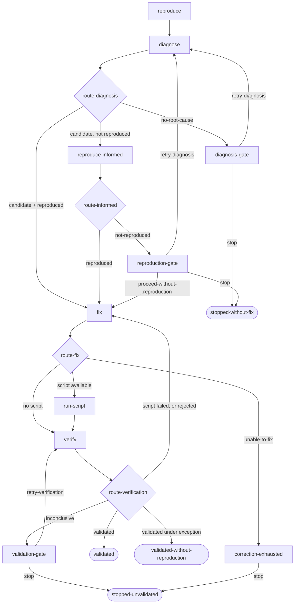

# The bugfix workflow

## Overview

`bugfix` is the worked example of a rigorous workflow: try to reproduce the
bug, diagnose it in the code, fix it, and verify the fix — stopping for a
person wherever the evidence does not decide.

The thing it is built around is what happens when QA *cannot* reproduce the
issue. That does not end the run and it does not authorize a fix. Diagnosis
runs anyway, with the negative evidence intact, and if it finds a candidate
cause, those findings go back to QA — in QA's own conversation, against
still-unfixed code — for another attempt. Only QA's evidence can establish a
reproduction. A code-level hypothesis is never relabelled as one.

It exists to demonstrate what the [workflow engine](workflow-engine.md) is for.
Nothing in it is hidden or heuristic — every route is explicit, every loop
bound is enforced by the engine, and every dead end is a human decision with
named alternatives.

## Definition

A packaged YAML document in workflow **format 2**
(`daemon/src/ompire_daemon/builtin_workflows/bugfix.yaml`). Each task pins the
revision it was accepted under, so the routes below describe *your task's*
`bugfix` — a later release that edits this definition does not change a run
already in flight. See
[Workflow engine](workflow-engine.md#definitions-and-revisions).

Sessions `["reproducer", "coder"]`, primary `coder` — so review, ship, and
task-scoped agent operations target the coder.

| # | Step | Kind | Session |
|---|---|---|---|
| 1 | `reproduce` | agent, declares results | `reproducer` |
| 2 | `diagnose` | agent, declares results | `coder` |
| 3 | `route-diagnosis` | decision | — |
| 4 | `reproduce-informed` | agent, declares results | `reproducer` |
| 5 | `route-informed` | decision | — |
| 6 | `fix` | agent, declares results | `coder` |
| 7 | `route-fix` | decision | — |
| 8 | `run-script` | command | — |
| 9 | `verify` | agent, declares results | `reproducer` |
| 10 | `route-verification` | decision | — |
| 11 | `diagnosis-gate` | gate, 2 choices | — |
| 12 | `reproduction-gate` | gate, 3 choices | — |
| 13 | `validation-gate` | gate, 2 choices | — |
| 14 | `investigation-exhausted` | gate, 1 choice | — |
| 15 | `correction-exhausted` | gate, 1 choice | — |

Splitting reproduction and fixing across two sessions is deliberate: the
session that decides whether the bug still reproduces is not the session that
wrote the fix. QA keeps one conversation across all three of its turns —
reproduction, informed reproduction, and verification — so it remembers what it
already tried. That separation is about context, not about models: each step
carries its own accepted model policy, and two steps in one session may differ.

## States and behavior

### 1. Reproduce

The prompt is the accepted preamble joined to the task's stored prompt — the
issue — and asks the agent to investigate, write an executable reproducer at
`.ompire/repro.sh` when the bug is scriptable, and report honestly either way.
It forbids fixing, modifying the code under test, and committing.

| Result | Required artifacts |
|---|---|
| `reproduced` | `attempts`, `expected_behavior`, `observed_behavior`, `reproduction_evidence`, `script_available` |
| `not-reproduced` | `attempts`, `observed_behavior`, `missing_prerequisites` |

`not-reproduced` is a real answer with a declared route, not a failure. The
prompt says so, and says explicitly that being unable to reproduce is not proof
there is no bug.

### 2. Diagnose

Runs after **either** result, in the coder session, and is told which one it
got. On a failed reproduction it receives what QA tried, what it observed
instead, and what it was missing, with the instruction that this is information
about the reproduction attempt rather than proof the code is correct.

This turn reads code and does not change it: changing the behavior now would
destroy the chance to demonstrate the bug.

| Result | Required artifacts |
|---|---|
| `candidate-found` | `findings`, `suspected_trigger`, `suggested_reproduction` |
| `no-root-cause` | `findings`, `missing_information` |

On a retry it also carries the operator's feedback from whichever gate sent it
back, presented as information rather than as instructions.

### 3. Route diagnosis

| Condition | Route |
|---|---|
| `no-root-cause` | `diagnosis-gate` |
| `candidate-found` and the bound reproduction is `reproduced` | `fix` |
| `candidate-found` and the bound reproduction is `not-reproduced` | `reproduce-informed` |
| anything else | [pause](workflow-engine.md#uncertainty-pauses) |

### 4. Reproduce, informed

The same QA conversation, now carrying the coder's findings, suspected trigger,
and suggested reproduction — and told the code is still unfixed, so anything it
can demonstrate now is genuine. Same results as step 1. The prompt says
plainly that the coder's theory being plausible is not a reproduction.

### 5. Route informed

`reproduced` goes to `fix`; `not-reproduced` goes to `reproduction-gate`.
Nothing else routes.

### 6. Fix

Plans and implements. It freezes the diagnosis, the matching reproduction, the
operator's exception if there is one, and — on a revisit — the verification
that rejected the previous attempt, bound to that exact attempt rather than to
whatever verification is newest.

When there is no reproduction, the prompt says so in as many words, quotes the
operator's rationale, and asks the coder to state in its validation notes what
it could and could not confirm.

| Result | Required artifacts |
|---|---|
| `implemented` | `changes`, `validation_notes` |
| `unable-to-fix` | `changes`, `validation_notes` |

It forbids editing `.ompire/` and weakening the reproducer, and instructs the
coder to **commit the fix on the task branch** and never push. Committing is
instructed, not load-bearing: review unstages everything for the reviewer
either way, and the ship flow's squash stages the whole working tree, so an
agent that stops at a worktree-only fix still ships correctly.

### 7. Route fix

| Condition | Route |
|---|---|
| `unable-to-fix` | `correction-exhausted` |
| `implemented`, and the bound reproduction says a script exists | `run-script` |
| `implemented` | `verify` |
| anything else | pause |

`unable-to-fix` stops for a person rather than sending an unfixed tree into
verification.

### 8. Run script

`bash .ompire/repro.sh` in the task's clone via `workshop exec`, recording the
exit code and an output tail. The argument vector is literal in the definition
— never built from anything an agent wrote.

### 9. Verify

QA verifies **in the session that reproduced the bug**, given the coder's
changes, the reproduction evidence or the explicit exception, and the script's
result when one ran. This turn happens even when the script passed: a passing
script says the script passes.

| Result | Required artifacts |
|---|---|
| `validated` | `checks`, `observations`, `limitations` |
| `rejected` | `checks`, `observations`, `limitations` |
| `inconclusive` | `checks`, `observations`, `limitations` |

Where no reproduction was ever established, the prompt asks QA to record that
in `limitations` and not to describe the check as a verified before/after.

### 10. Route verification

Evaluated in order:

| Condition | Result |
|---|---|
| The verification checked a different fix than the current one | pause |
| A script ran for this fix and exited non-zero | back to `fix` |
| `validated`, under an operator exception | run completes `validated-without-reproduction` |
| `validated` | run completes `validated` |
| `rejected` | back to `fix`, with the report |
| `inconclusive` | `validation-gate` |
| anything else | pause |

**A failing script cannot be overridden by a positive verdict.** If the
reproducer still fails, the bug is still there whatever the turn concluded.

### 11–13. The gates a person answers

Each names what it is asking about and what each answer will do.

| Gate | Choices |
|---|---|
| `diagnosis-gate` | `retry-diagnosis` (reason required) → `diagnose`; `stop` → `stopped-without-fix` |
| `reproduction-gate` | `retry-diagnosis` (reason required) → `diagnose`; `proceed-without-reproduction` (rationale required) → `fix`; `stop` → `stopped-without-fix` |
| `validation-gate` | `retry-verification` (reason required) → `verify`; `stop` → `stopped-unvalidated` |

`proceed-without-reproduction` is the one place a fix is authorized without a
demonstrated bug. It requires a rationale, that rationale is recorded and shown
to the fix and the verification that follow, and the run ends
`validated-without-reproduction` rather than claiming a proof it never had. The
exception is tied to the diagnosis it was granted against: a later diagnosis
leaves the old exception on the record but stops it authorizing anything new.

### 14–15. The gates that only stop

`investigation-exhausted` and `correction-exhausted` offer `stop` and nothing
else. They sit outside the loops they end, so an exhausted budget cannot be
answered back into the loop that exhausted it.

## Bounds

Five steps carry a **three-attempt budget for the whole run**: `reproduce`,
`diagnose`, `reproduce-informed`, `fix`, and `verify`. Each is declared on the
step and enforced by the engine, which counts attempts *before* opening a new
one — so the route predicate is not what stops a loop, and a mistake in one
cannot make a loop run forever.

Exhausting an investigation budget opens `investigation-exhausted`; exhausting
`fix` or `verify` opens `correction-exhausted`. **No gate answer refills a
budget**: a `retry-diagnosis` answer given after `diagnose` has spent its three
attempts reaches the exhaustion gate instead of opening a fourth. Verification
retries consume the same three-attempt budget, so they can reduce how many fix
iterations a run can still validate.

A daemon restart mid-attempt costs no visit.

## Endings

| Result | Meaning |
|---|---|
| `validated` | QA verified the fix against a reproduction it established |
| `validated-without-reproduction` | QA verified what it could, but the bug was never demonstrated and an operator authorized the fix anyway |
| `stopped-without-fix` | The run stopped before a fix was authorized |
| `stopped-unvalidated` | A fix exists or was attempted, but nothing validated it |

The run's ending is recorded on the task, so a finished bugfix says which of
these it was rather than only that it stopped.

## Failures and recovery

Missing evidence stops the run rather than being classified. A turn that leaves
no readable result, a result naming something the step does not declare, a
required artifact left out or blank, a route that cannot be decided, and a
required evidence selector that matched nothing all raise an
[uncertainty pause](workflow-engine.md#uncertainty-pauses) naming what was
wrong. Retrying makes another attempt at that same step; it never continues
past it.

That is different from the gates above, which are routes the definition
declares for results it *did* understand.

A finished run leaves the workspace and sessions alive until cleanup.

## Using it

Choose `bugfix` as the workflow on the Spawn view, or pass
`"workflow_name": "bugfix"` to `POST /api/tasks/preview` and `POST /api/tasks`.
Every project can run it; nothing has to be configured first.

Every agent step declares the `default` role. That is the starting point, not a
fixed one: `reproduce`, `diagnose`, `reproduce-informed`, `fix`, and `verify`
can each be sent to a different model profile or role at launch, independently.
The Spawn view lists all five — every model consumer is one of these steps —
before you submit.

The three `reproducer` steps share one session and so share its conversation,
and they can still run under different policies. When one needs a different
`smol`, `slow`, or `plan` binding than the last left in effect, that session's
agent process is restarted and its native session resumed: the context carries
over, and the session reads as *starting* for a moment. A repeated `fix` uses
`fix`'s own accepted binding each time, whatever ran in between.

The task prompt should be the issue — what is wrong, and how to observe it.
The workflow supplies the procedure.

### Reading a run of it

The whole procedure is readable in the UI without opening YAML — in the library
before you launch, in the Spawn preview as the exact revision you are
accepting, and in task detail as the revision that task pinned.

The three things this workflow's shape turns on are all visible there:

- **The branches.** Each routing step lists its ordered conditions and where
  each one leads, including the informed-reproduction return and the
  rejected-fix loop back to `fix`. They are declared routes, not predictions:
  nothing on the page evaluates a condition, so no branch is shown as the one
  a run took.
- **The gates.** A gate card shows its question and the answers it offers, and
  once somebody has answered, which answer they chose, the reason they wrote,
  and where it went. A gate the run never reached stays visible as a possible
  stop and offers no action.
- **The reused QA session.** `reproduce`, `reproduce-informed`, and `verify`
  all show `reproducer` as their agent, and each attempt links into that one
  conversation. The evidence each step was handed links to the exact producing
  attempt, so a verification says which fix attempt it checked rather than
  implying it checked the newest.

A failed first reproduction is a declared result with its own evidence, and it
reaches `diagnose` intact. Nothing in this surface relabels a code-level
hypothesis as a reproduction.

## Older bugfix runs

A task accepted before this revision keeps running the definition it pinned.
Earlier `bugfix` was workflow format 1 with a different shape —
`reproduce → triage → fix → validate → check → escalate` — and those runs
continue under exactly those rules. Their step history is unchanged and stays
readable.

A task old enough to predate retained definitions altogether cannot be
continued onto this one: its results were recorded under format 1's
success/failed envelope, which the format-2 contract cannot reinterpret, and it
ran steps this definition does not declare. Ompire says so rather than
migrating it. See
[Compatibility across formats](workflow-engine.md#compatibility-across-formats).
